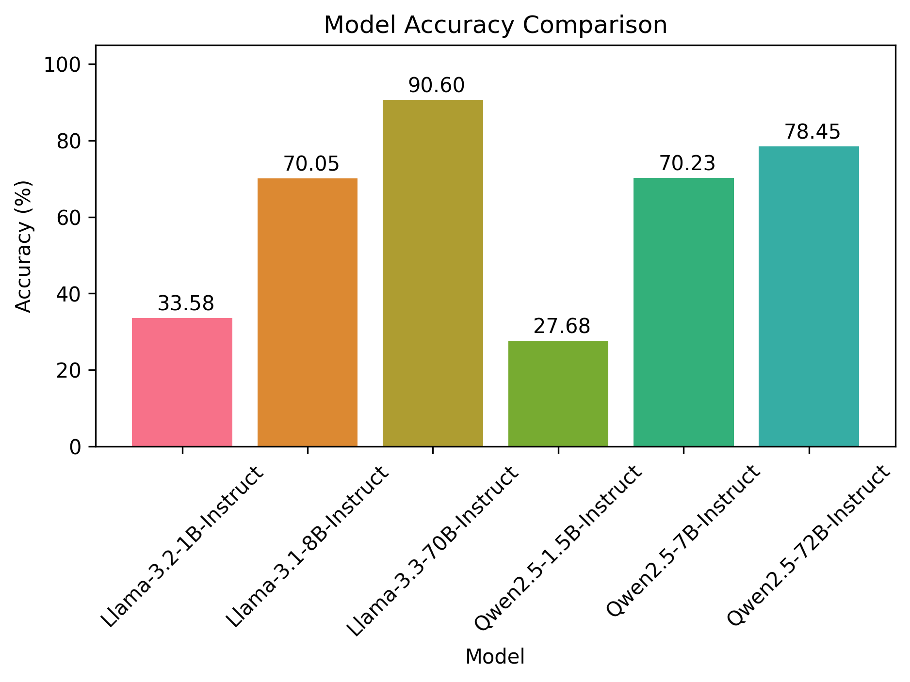
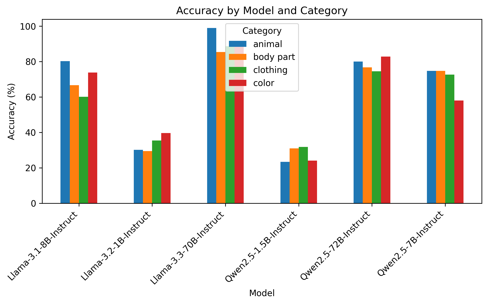
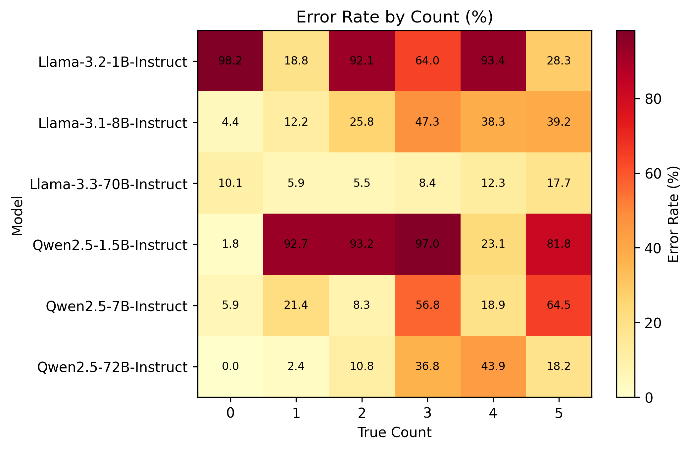
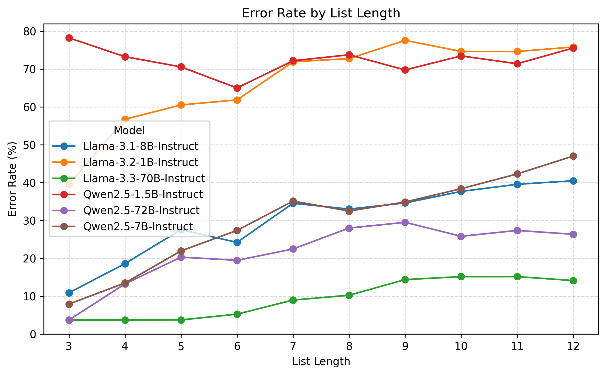
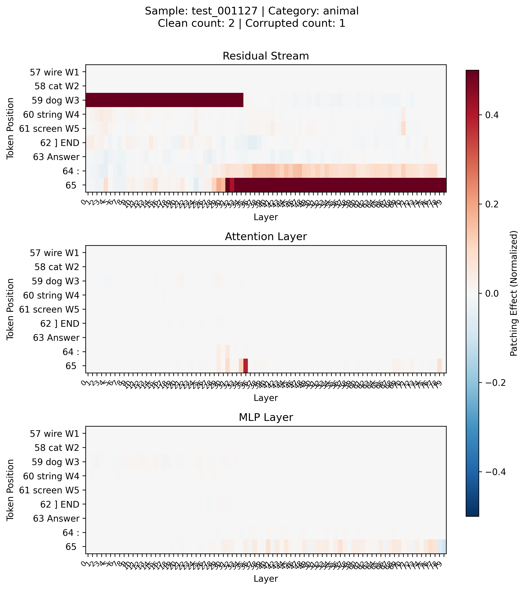
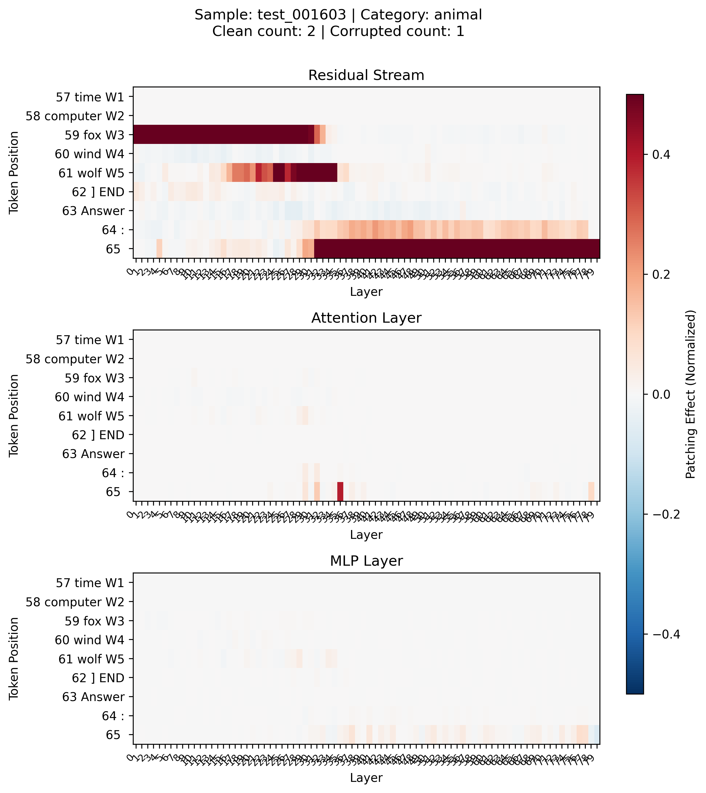
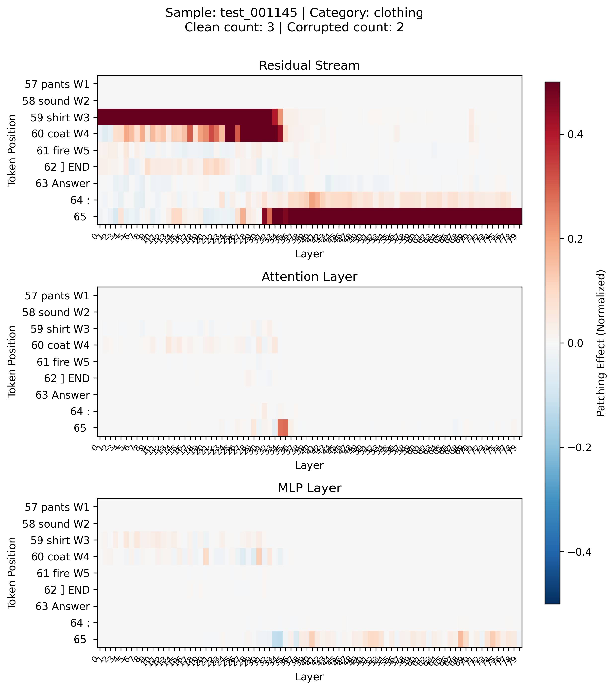
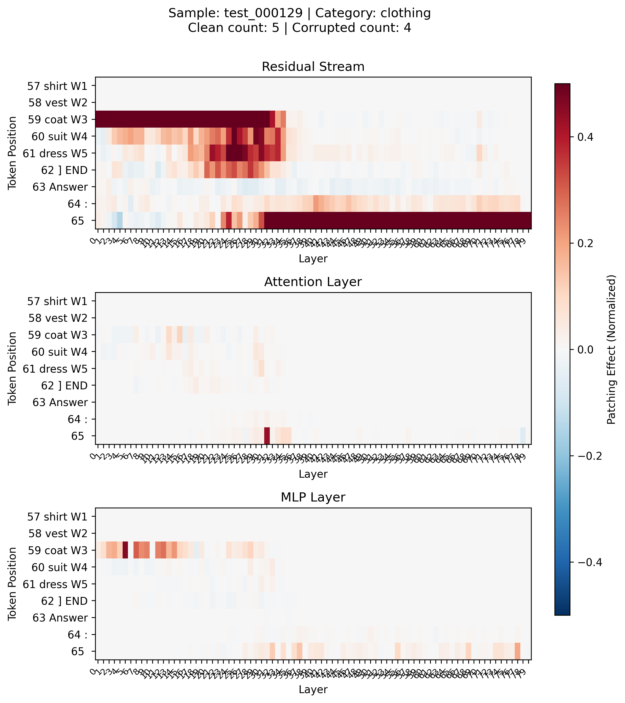
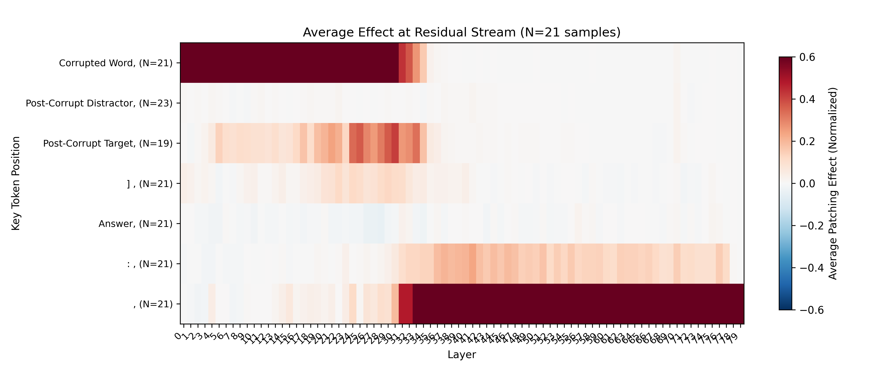
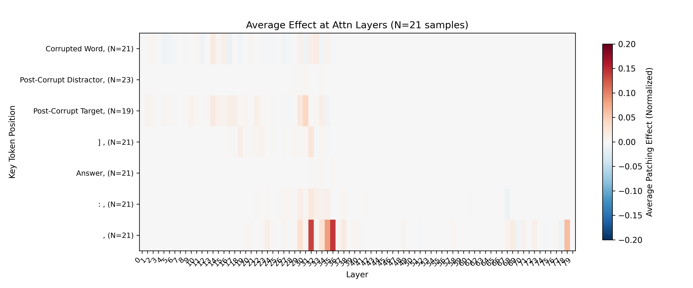

# Mechanism of Counting

This is a toy project investigates how LLMs internally represent and track counting information when performing categorical word counting tasks using activation patching.

## Task Description
We focus on counting tasks of the format below:
```
Count the number of words in the following list that match the given type, and put the numerical answer in parentheses.
Type: fruit
List: [dog apple cherry bus cat grape bowl]
Answer: (3)
```
The **RQs** are:
1. How do different sized language models perform on zero-shot counting tasks?
2. Is there evidence for hidden state layers containing running count representations during list processing?
3. Where in the model architecture does counting computation occur (layer/component)?

## Dataset Generation
We constructed a controlled dataset using four semantic **categories**. Each word is carefully selected to be as *non-controversial* as possible and to be *single-token* for the simplicity of implementation of activation patching:

```python
categories = {
    'clothing': ['shirt', 'pants', 'dress', 'coat', 'vest', 'suit'],
    'animal': ['dog', 'cat', 'bird', 'fish', 'wolf', 'fox', 'cow'],
    'color': ['red', 'blue', 'green', 'yellow', 'black', 'white', 'brown'],
    'body part': ['hand', 'leg', 'ear', 'eye', 'mouth', 'arm', 'foot']
}
```
**Distractors**: 40 semantically neutral *single-token* words (e.g., 'book', 'stone', 'clock', 'water'). 

**Dataset details**
- List length: 3-12 words (uniformly distributed)
- Target count: 0 to min(5, list_length) (uniformly distributed)
- Total samples: 2000 examples
- Tokenization: All words verified as single tokens across tested tokenizers

**Corrupted samples**: We also corrupt each sample by randomly selecting a word and changing it from a target word to a distractor, or vice-versa.

**Prompt design**: After experimentation, we settled on this prompt structure to ensure reliable integer outputs:
```
Analyze the word list below. Count ONLY words that are {category}.
Follow these rules:
1. Strictly match the type definition (case-sensitive)
2. Ignore non-word elements
3. Output ONLY one integer count and nothing else

Type: {category}
List: [{word_list}]
Answer:
```
## Model Evalution
**Tested models:**
- Llama-3.2-1B-Instruct
- Llama-3.1-8B-Instruct
- Llama-3.3-70B-Instruct
- Qwen2.5-1.5B-Instruct
- Qwen2.5-7B-Instruct
- Qwen2.5-72B-Instruct.






**Takeaways:**
- Larger models significantly outperform smaller ones (70B >> 8B >> 1B). The accuracies range from ~30% to ~90%. This dramatic scaling effect suggests that counting requires sophisticated internal representation that benefir from increased scale.
- Performance remains relatively consistent across semantic categories, suggesting that the difficulties across categories in our dataset are consistent and the counting mechanism is likely domain-general.
- Accuracy doesn't strictly correlate with true count, suggesting models might have some counting priors. Rather than implementing perfect arithmetic, the model appears to have learned distributional biases about likely counts, possibly reflecting training data statistics ([Zhang et al., 2025](https://arxiv.org/abs/2504.12585)). 
- Error rate increases with longer lists. This increase likely reflects accumulating errors in the incremental updating process and potential limitations in the attention mechanism's ability to effectively route information from distant word positions to the final token.

## Activation Patching

Following suggests from [Zhang & Nanda (2024)](https://arxiv.org/abs/2309.16042), we implemented **Symmetric Token Replacement (STR)** experiments. We measure effect of patching with normalized logit differences, for each layer, for each token since the first word of the list, on residual stream, attention layer, and MLP layer. 

Due to time and compute constraint, we only conduct experiments on Llama-70B with 21 samples and Llama-8B with 300 samples. The 21 samples on Llama-70B are all with list length of 5 and corruption on the 3rd word in the list. 

### Single Sample Qualitative Results
We show four representative samples from Llama-70B below:
Sample A: [word1] [word2] [*CORRUPT*] [distractor] [distractor] |  Sample B: [word1] [word2] [*CORRUPT*] [distractor] [*TARGET*]
:-------------------------:|:-------------------------:
  |  

Sample C: [word1] [word2] [*CORRUPT*] [*TARGET*] [distractor] |  Sample D: [word1] [word2] [*CORRUPT*] [*TARGET*] [*TARGET*]
:-------------------------:|:-------------------------:
  |  

**Residual stream observations:**
1. Strong patching effects at **corrupted word** at **early and mid** layers (Word 3 for all four samples).
2. Post-corruption, only **target words** show strong effects at **mid-layer** (W5 for Sample B, W4 for Sample C, and W4/W5 for Sample D), while patching at post-corruption distractors has basically no effect (W4/W5 for Sample A, W4 for Sample B, and W5 for Sample C).
3. Strong effects at **final token** in **later** layers, with weaker but notable effects at second-to-last token

**Attention layer observations:**
Notable effects only at specific **mid-layers** (around layer 35) at **final token** position. These effects appear at the same layers where residual stream effects transition from word list to final token. This suggests attention layers at mid-layers route information about counting from the word list to the last token for next token prediction.

**MLP layer:** patching exhibits some weak effects at the corruption word position at early layers and the final token position at later layers.

### Multi-Sample Aggregation
Averaging effects across 21 samples at Llama-70B reveals patterns consistent with the qualitative results above:


1. **Corrupted word**: Strong early-mid layer effects 
2. **Post-corruption distractors**: Minimal effect across all layers
3. **Post-corruption targets**: Strong mid-layer effects
4. **Second-to-last token**: Moderate late-layer effects 
5. **Final token**: Strong late-layer effects 


- **Final token**: Strong effects in mid layers 30-35
- Minimal effect at all other locations

### Discussion

Based on these activation patching results, we propose a incremental counting mechanism in Llama-3.3-70B model. The computational flow operates in three phases: (1) **Early-layer classification (layers 0-20)** processes individual words and determines their category (target vs. distractor), evidenced by strong patching effects at the corrupted position across early layers; (2) **Mid-layer incremental counting (layers 20-35)** selectively updates an internal count representation only when processing target words. The model maintains a running count that is conditionally updated based on word classification. This incremental update of counting only happens for target words, but not distractors, which explains why post-corruption targets show strong mid-layer effects but no early-layer effect while distractors show minimal effects; and (3) **Late-layer information routing and prediction (layers 30-80)** where attention mechanisms (particularly around layer 30-35) transfer the accumulated count information from word positions to the final token position for next-token prediction, as evidenced by (a) the concentrated attention effects, (b) strong late-layer residual stream effects at the final token, and (c) minimal late-layer residual stream effects for the word list. This mechanism demonstrates that large language models implement counting through a sophisticated pipeline that combines parallel word classification with selective state updating, followed by attention-mediated information aggregation—rather than simple batch processing or position-independent feature detection.

The computation mechnism is likely to be something like this:
```
Input Classification → Running Count Update → Final Aggregation → Output
    (layers 0-20)        (layers 20-35)        (layers 30-80)
```